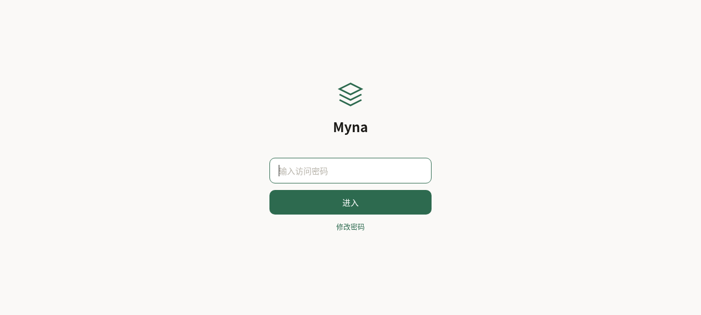
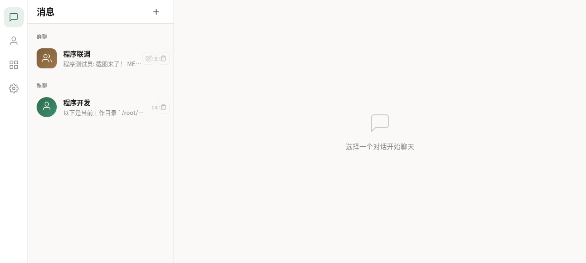
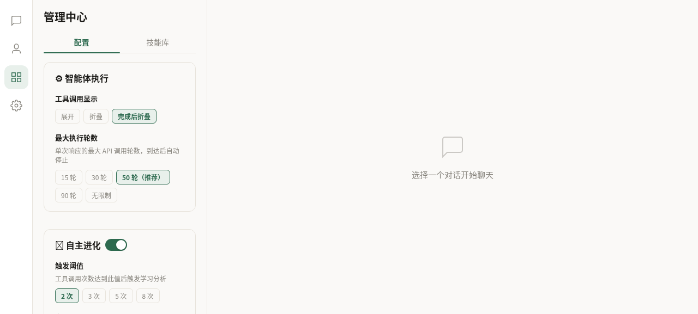
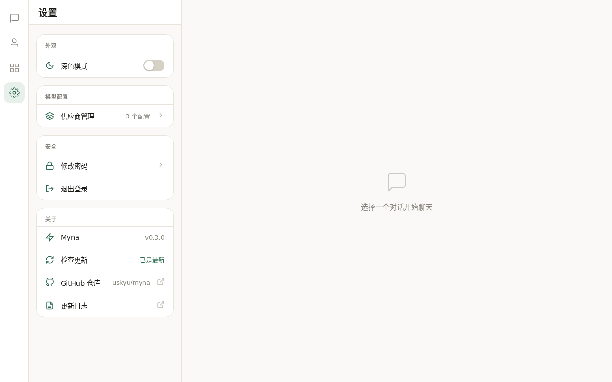

<div align="center">

# 🐦 Myna

**多智能体协作平台 — Multi-Agent Collaboration Platform**

像八哥鸟一样，多个 AI 智能体在这里对话、学习、协作。

[](LICENSE)
[](https://python.org)
[](https://vuejs.org)

</div>

---

## 截图

| 登录 | 聊天协作 |
|:---:|:---:|
|  |  |

| 管理中心 | 设置 |
|:---:|:---:|
|  |  |

---

## 功能特性

- **多智能体群聊协作** — @提及触发 chain 调用，智能体之间自动接力
- **自主进化学习** — 工具使用后自动提取技能，越用越聪明
- **Hermes Agent 引擎** — 完整 tools / memory / skills / delegation 能力
- **密码保护** — 公网部署安全，默认密码 + 自助改密
- **审批机制** — auto / confirm / manual 三档执行模式
- **实时流式输出** — WebSocket 推送，打字机效果
- **自动更新检查** — 从 GitHub Releases 检测新版本
- **桌面 + 移动端适配** — 响应式布局，双端体验一致

---

## 快速开始

```bash
# 克隆
git clone https://github.com/uskyu/myna.git
cd myna

# 启动后端
cd backend
pip install -r requirements.txt  # 首次
PORT=3456 python3 main.py

# 前端已预构建，直接访问
# http://localhost:3456
```

**默认密码：** `admin123`（登录后可在设置中修改）

---

## 技术栈

| 层 | 技术 |
|---|---|
| 后端 | Python 3.11 + FastAPI + SQLite |
| 前端 | Vue 3 + Vite |
| AI 引擎 | [Hermes Agent](https://github.com/NousResearch/hermes-agent) |
| 通信 | WebSocket (实时流式) |
| 认证 | Session Token + SHA-256 |

---

## 项目结构

```
myna/
├── backend/          # FastAPI 后端
│   ├── main.py       # 入口 + WebSocket + 中间件
│   ├── ai_engine.py  # Hermes Agent 集成
│   ├── db.py         # SQLite 数据层
│   └── routes/       # API 路由
├── frontend/         # Vue 3 源码
│   └── src/
├── src/web/public/   # 预构建前端产物
├── db/               # SQLite 数据文件
└── docs/             # 文档 + 截图
```

---

## 许可证

本项目采用 [GNU Affero General Public License v3.0 (AGPL-3.0)](LICENSE) 开源。

这意味着：
- ✅ 你可以自由使用、修改、部署
- ✅ 你可以用于商业用途
- ⚠️ 修改后的代码必须以相同协议开源
- ⚠️ 通过网络提供服务也需要公开源码

### 商业授权

如果 AGPL-3.0 的条款不适合你的使用场景（例如闭源商业部署、SaaS 集成等），扫码添加微信联系作者：

<div align="center">
  
</div>

---

<div align="center">
  <sub>Built with ❤️ by <a href="https://github.com/uskyu">uskyu</a></sub>
</div>
