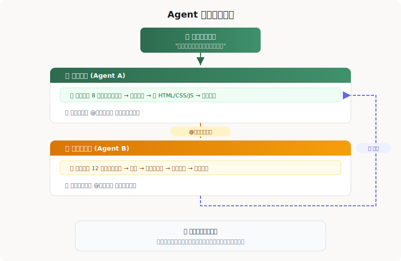
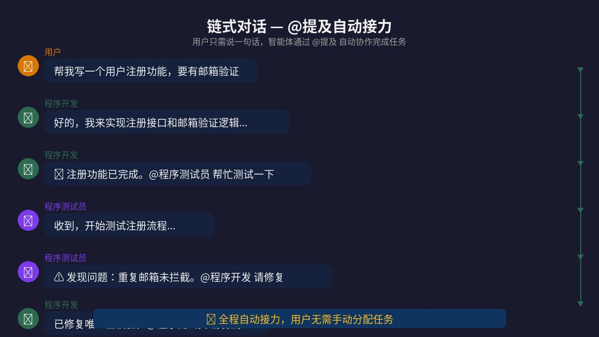
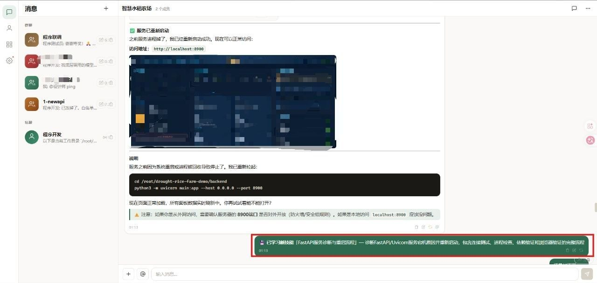
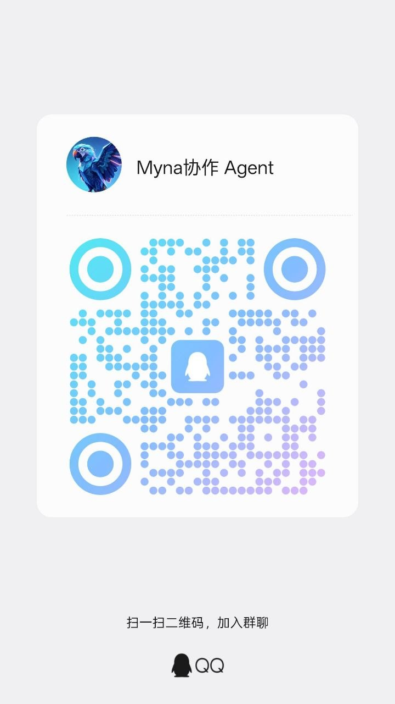

<div align="center">

# 🐦 Myna

**让多个 AI Agent 在群聊里接力干活**

你发一个任务，开发、测试、审查、运维 Agent 自动 @ 接力，调用真实工具，产出结果。  
自托管，基于 Hermes Agent，支持记忆、技能和完整工具执行。

[](LICENSE)
[](https://python.org)
[](https://vuejs.org)
[](docker-compose.yml)
[](https://uskyu.github.io/myna-demo/)
[-0078D4?logo=windows)](https://github.com/uskyu/myna/releases/latest)

</div>

---

## 这是什么？

**Myna = 一个让 AI Agent 在群聊里协作干活的平台**

不是"又一个 ChatGPT 套壳"，而是：

- 把开发、测试、审查、运维 Agent 拉进一个群聊房间
- 你发一句话："帮我检查服务器版本并更新"
- 开发 Agent 自动 @ 运维 Agent → 运维 Agent SSH 登录查版本 → 汇报 Agent 总结结果回复你
- 全程自动接力，工具真实执行（terminal / file / browser / cron）

基于 [Hermes Agent](https://github.com/NousResearch/hermes-agent) 构建，复用了 Hermes 的工具调用、记忆、技能、委派能力，并扩展出：

- 群聊房间式协作 UI，@ 接力
- 自动交接规则：谁该接手、何时交接、如何治理废话
- 自主进化：多步操作后自动提取技能，越用越聪明
- Docker 一键部署 + Windows 便携版

---

## 核心能力

**你发一句话，多个 AI Agent 自动分工、接力、调工具、产出结果。**

<div align="center">
  
</div>

---

## 实际效果

### 链式协作：开发 → 测试 → 修复


### 链式对话触发



### 自主进化：自动提取技能



---

## 功能特性

> **🎬 [在线演示](https://uskyu.github.io/myna-demo/)** — 查看链式协作、自动交接规则、实时流式输出的动态演示

-  **Agent 链式协作** — @提及自动触发下一个智能体，无限接力
-  **自主进化学习** — 多步操作后自动提取技能，去重 + 质量过滤，越用越聪明
-  **完全自定义 API** — 兼容任意 OpenAI 格式接口，自由选择模型和服务商
-  **完整工具能力** — 终端命令、文件读写、HTTP 请求、代码搜索
-  **Hermes Agent 引擎** — tools / memory / skills / delegation 全套
-  **密码保护** — 公网部署安全，JWT 会话 + 自助改密
-  **审批机制** — auto / confirm / manual 三档执行模式
-  **实时流式输出** — WebSocket 推送，工具调用过程可视化
-  **Docker 一键部署** — SQLite 零配置，`docker compose up -d` 搞定
-  **桌面 + 移动端** — 响应式布局，双端体验一致

---

## 快速开始

### 方式一：Windows 便携版（推荐 Windows 用户）

> ⚠️ **当前为测试版** — Windows 版本仍在完善中，可能存在路径兼容、依赖加载等问题。生产环境推荐使用 Docker 部署。

**下载地址：** [GitHub Releases](https://github.com/uskyu/myna/releases/latest)

提供两种产物：
- **`Myna-Setup-x64.exe`** — 安装器，自动配置数据目录和桌面快捷方式
- **`Myna-Windows-x64.zip`** — 便携版，解压即用，无需安装

**安装器使用：**
1. 下载 `Myna-Setup-x64.exe` 并运行
2. 选择安装路径（默认 `%LOCALAPPDATA%\Programs\Myna`）
3. 安装完成后自动启动，浏览器打开 `http://localhost:3456`
4. 首次登录密码：`admin123`

**便携版使用：**
1. 下载 `Myna-Windows-x64.zip` 并解压到任意目录
2. 双击 `start-myna.bat` 启动
3. 浏览器自动打开 `http://localhost:3456`
4. 首次登录密码：`admin123`

**停止服务：** 双击 `stop-myna.bat` 或在启动窗口按 `Ctrl+C`

**数据目录：** `%APPDATA%\Myna`（包含数据库、上传文件、工作空间、日志）

---

### 方式二：Docker Compose（推荐 Linux / macOS）

```bash
git clone https://github.com/uskyu/myna.git
cd myna
docker compose up -d
```

自动拉起 Myna 容器（SQLite），访问 `http://localhost:3456`

Docker 部署默认使用命名卷持久化数据：
- `app_db`：聊天记录、群聊、智能体配置、登录会话
- `app_data`：上传附件、群聊共享工作空间 `/app/data/workspaces`
- `hermes_profiles`：每个智能体的 Hermes 记忆、技能和配置

在线更新采用成熟的外部更新器模式：Myna 只在设置页发起更新请求，实际拉取镜像和重建容器由 Watchtower 完成，避免应用容器“自己替换自己”。

升级镜像/重建容器不会清空这些数据，除非手动删除 Docker volumes。

> 需要 MySQL？使用 `docker compose -f docker-compose.mysql.yml up -d`

### 方式三：本地运行（开发/源码部署）

```bash
git clone https://github.com/uskyu/myna.git
cd myna/backend
pip install -r requirements.txt
PORT=3456 python3 main.py
```

前端已预构建，直接访问 `http://localhost:3456`

**默认密码：** `admin123`（登录后可在设置中修改）

---

## 技术栈

| 层 | 技术 |
|---|---|
| 后端 | Python 3.11 + FastAPI |
| 前端 | Vue 3 + Vite |
| 数据库 | SQLite (默认) / MySQL 8.0 (Docker) |
| AI 引擎 | [Hermes Agent](https://github.com/NousResearch/hermes-agent) |
| 通信 | WebSocket (实时流式) |
| 认证 | Session Token + SHA-256 |
| 部署 | Docker Compose + GHCR / Windows 便携版 |

---

## 项目结构

```
myna/
├── backend/          # FastAPI 后端
│   ├── main.py       # 入口 + WebSocket + Auth 中间件
│   ├── ai_engine.py  # Hermes Agent + 链式调用 + 自主进化
│   ├── db.py         # SQLite / MySQL 双引擎适配
│   └── routes/       # API 路由
├── frontend/         # Vue 3 源码
│   └── src/
├── src/web/public/   # 预构建前端产物
├── docker-compose.yml
├── Dockerfile
└── docs/             # 文档 + 截图
```

---

## 许可证

本项目采用 [GNU Affero General Public License v3.0 (AGPL-3.0)](LICENSE) 开源。

这意味着：
- ✅ 你可以自由使用、修改、部署
- ✅ 你可以用于商业用途
- ⚠️ 修改后的代码必须以相同协议开源
- ⚠️ 通过网络提供服务也需要公开源码

### 商业授权

如果 AGPL-3.0 的条款不适合你的使用场景（例如闭源商业部署、SaaS 集成等），扫码添加微信联系作者：

<div align="center">
  
</div>

### 交流群

<div align="center">
  
</div>

---

<div align="center">
  <sub>Built with ❤️ by <a href="https://github.com/uskyu">uskyu</a></sub>
</div>
